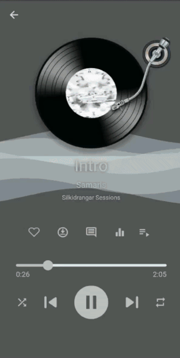

# Jio Music

A free Music Player for the world.

##How it looks

## What is it?

Jio Music Player is based on the concept of Buddhism. We are on this Earth together, and we should strive to do good deeds for others. I made the code for the player public so that others may use it for their own purposes. Feel free to learn from this code (although I wouldn't describe myself as having the best coding practices), or compile your own Music Player.

## License
This software is published under the [GNU GENERAL PUBLIC LICENSE](./COPYING).

## Why use Jio?
The main thing I wanted with Jio was to make a hassle-free music player that can play local music. Once that was done, I wanted to be able to listen to free music. At that time I found out that it's possible to use the QQ, Netease, Kugou and Kuwo APIs to listen to songs for free. Thus, this app was slowly born.

## Work in Progress
Please remember that this app is still largely a work in progress. I am once person working on this in my own spare time. If you like this app, I would appreciate any support you can give.

## Support me
###[Buy me a coffee🤗](https://www.buymeacoffee.com/alexanderg5)

## How the Icon is made
 The icon for the app is made using IconKitchen. Link here: [Click me](https://icon.kitchen/i/H4sIAAAAAAAAAzWQTU%2FDMAyG%2F0plrkOiGxtab3xsCATSJHoCcUgbN42U1iVNQNXU%2F46dwi157PdxnDN8KxdxhOIMjSmnAaEA2ymDsGJwaBqsA1dhbJWmH4aVuSdHntHFOt%2Fvmk1if0njlbbYh8Qe%2Fy%2FsriWTS2i72T0cD9yQ0FrQvl7fVFeMVG8ca663s%2BTfWpWk41e0vuaCvOiktLa9EWegAYo8X4G3puUpcqwoBOqWs8MmUZYNY2mDqOHZUvYaR1uzjakyzvbCb7PSRzdlR4%2B4NGQnpyb0qe%2Bpph6K4CPK7UVNFFkNbSoeadmxUZ11k7juEN8RYebJHeno5H8%2FeDvtyWrJsPlyDOQRPudf2G0vt4MBAAA%3D)